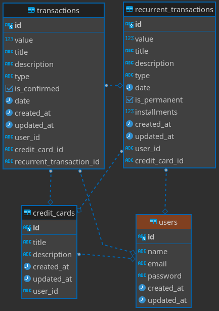

<p align="center">
  
</p>

<p align="center">A personal finance manager app.</p>

## Description

This is a simple personal financial manager app that should allow the user to insert their transactions, either be simple transactions or periodic transactions, and associate them with one credit card if necessary.

## Installation

_Obs: make sure that docker is installed._

**1. Node.js dependencies**

Install all the dependencies typing:

```bash
$ yarn install
```

**2. Docker**

The app uses a connection with Postres SQL. To create a new one, you can just type

```bash
$ docker-compose up
```

to create a new instance with the settings stablished on `docker-compose.yml` file, located at the root path.

## Running the app

```bash
# development
$ yarn start

# watch mode
$ yarn start:dev

# production mode
$ yarn start:prod
```

## Tecnologies

- GraphQL
- Typescript
- Postgres SQL
- SQLite
- TypeORM
- Docker
- Bcrypt
- JWT
- Nest.js
- Jest

## Database

<p align="center">
  
</p>

- **Transactions**

  Should contain all existing user transactions at this time, either be a simple transaction, or either be generated through querying an recurrent transaction. The transaction created represents the traffic in the account, beeing a income or outcome transaction, with one title and description.

  About some fields, the `is_confirmed` field is used to indicated wheter the transaction is already paid/received or not, and the `credit_card_id`, as the name says, indicates the id that represents the credit card.

- **Recurrent Transactions**

  Would be used to create some transaction that repeat more than one time, like
  monthly debts and debts debts in installments

  Has basically the same fields founded in the _Transactions Table_. Thats why the _Recurrent Transactions_ is used behind the scenes to create an materialized replica of that transaction referring the requested period.

  It's just a table for consultation, which serves to read the data of recurring transactions and make them real when consulted in some period where they should exist.

- **Credit Cards**

  It's just the table to store the user's credit cards, with their titles and descriptions.

- **Users**

  The table responsible to store the user's data, such as the name, email and the password.

## License

Nest is [MIT licensed](LICENSE).
